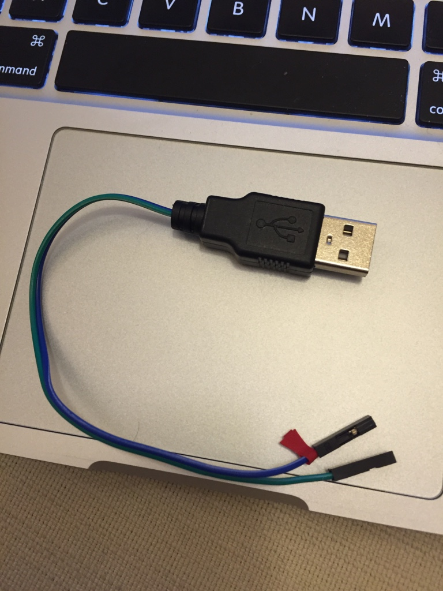

# cheap-virtual-window
A cheap version of virtual window

# Installation steps

## Site A

### Hardware

1.  Standard connection of Pi Camera module
2.  Servos

1.  Signal of Servo 0 connect to GPIO 4
2.  Signal of Servo 1 connect to GPIO 17
3.  Vin and ground of Servo 0, and 1 connect to external power (e.g. using usb to dupont cable)
4.  Ground of external power connect to GND pin on Pi

(usb to dupont cable)

(GPIO pin assignment on Pi)

5.  Try it, based on Try it of [Install and Setup ServoBlaster](#h.an82c5vrwfae) below

### Install and Setup Raspbian

Headless installation (i.e. no keyboard, mouse, and monitor attached to the pi)

1.  Download raspbian image (e.g. 2016-03-18-raspbian-jessie.zip) from ([https://www.raspberrypi.org/downloads/](https://www.google.com/url?q=https://www.raspberrypi.org/downloads/&sa=D&ust=1461407533756000&usg=AFQjCNGu54nfY1WZ7KVTP1bb_Orn9nyRGw)), and unzip it
2.  Format the SD card (MS-DOS FAT)
3.  Write the raspbian image to the sd card (assumed on Linux/Mac and sd card on /dev/disk2)

1.  diskutil diskunmountDisk /dev/disk2
2.  sudo dd bs=1m if=2016-03-18-raspbian-jessie.img of=/dev/rdisk2
3.  diskutil eject /dev/disk2

1.  Plug the sd into the pi and also plug in the LAN cable, then power on the pi
2.  Check the IP address of the Pi, by using tools like nmap

1.  E.g. nmap -sP 192.168.1.0/24

1.  SSH to the pi (default: user name is pi, password is raspberry), assumed the ip address is 192.168.1.10

1.  shh pi@192.168.1.10

1.  Modify the ~/.profile file, append the 2 lines below

1.  export LC_ALL=C
2.  export LC_CTYPE=UTF-8

1.  Source the updated .profile

1.  source ~/.profile

1.  Update the config file (/etc/wpa_supplicant/wpa_supplicant.conf) for wifi access

1.  Append the block like below

<table class="c19">

<tbody>

<tr class="c0">

<td class="c17" colspan="1" rowspan="1">

network={

ssid="Your Wireless Network Name"

psk="Your Wireless Password"

# Protocol type can be: RSN (for WPA2) and WPA (for WPA1)

proto=RSN

# Key management type can be: WPA-PSK or WPA-EAP (Pre-Shared or Enterprise)

key_mgmt=WPA-PSK

# Pairwise can be CCMP or TKIP (for WPA2 or WPA1)

pairwise=CCMP

#Authorization option should be OPEN for both WPA1/WPA2 (in less commonly used are SHARED and LEAP)

auth_alg=OPEN

}

</td>

</tr>

</tbody>

</table>

1.  Run raspi-config to change configuration

1.  sudo raspi-config
2.  1\. Expand Filesystem
3.  5\. Internationalisation Options -> I1 Change Timezone
4.  6\. Enable Camera
5.  9\. Advanced Options -> A2 Hostname
6.  9\. Advanced Options -> A0 Update
7.  Finish and reboot, if there is no prompt for reboot, then can run

1.  sudo reboot

1.   Update the system package

1.  sudo apt-get update

1.  Upgrade the installed package

1.  sudo apt-get dist-upgrade

### Install and Setup Mjpg-Streamer

1.  Install dependencies

1.  sudo apt-get install libjpeg8-dev imagemagick libv4l-dev cmake
2.  Create a symoblic link

1.  sudo ln -s /usr/include/linux/videodev2.h /usr/include/linux/videodev.h

1.  Download and unzip mjpg-streamer

1.  wget [https://github.com/jacksonliam/mjpg-streamer/archive/master.zip](https://www.google.com/url?q=https://github.com/jacksonliam/mjpg-streamer/archive/master.zip&sa=D&ust=1461407533774000&usg=AFQjCNEMEsGgHsPMrl2NlOl6Gb5PcCYU-w)
2.  unzip master.zip

1.  Make it

1.  cd mjpg-streamer-master/mjpg-streamer-experimental
2.  make clean all

1.  Copy the build files

1.  sudo cp mjpg_streamer /usr/local/bin
2.  sudo cp *.so /usr/local/lib/
3.  sudo cp -R www /usr/local/www

1.  Modify ~/.profile, append the following line, and source it

1.  export LD_LIBRARY_PATH=/usr/local/lib/
2.  source ~/.profile

1.  Try it

1.  If try Pi camera module, then runs

1.  mjpg_streamer -b -o "output_http.so -w /usr/local/www" -i "input_raspicam.so -x 640 -y 480 -fps 60"

1.  If try usb camera module, then runs

1.  mjpg_streamer -b -o "output_http.so -w /usr/local/www" -i "input_uvc.so"

1.  Note -b means background execution
2.  Start a browser and visit the url below (change the ip if necessary)

1.  [http://192.168.1.7:8080/](https://www.google.com/url?q=http://192.168.1.7:8080/&sa=D&ust=1461407533780000&usg=AFQjCNH-HBsftAPC5vtBioSU9on5oH38sQ)

1.  Start it after boot, and capture 640x480 resolution at 60fps

1.  Create a script file ~/start_mjpg_streamer.sh with the following content

<table class="c18">

<tbody>

<tr class="c0">

<td class="c17" colspan="1" rowspan="1">

#!/bin/sh

mjpg_streamer -b -o "output_http.so -w /usr/local/www" -i "input_raspicam.so -x $1 -y $2 -fps $3"

</td>

</tr>

</tbody>

</table>

1.  Change the mode of the file to 755

1.  chmod 755 ~/start_mjpg_streamer.sh

1.  Append the following line to the ~/.profile

1.  ~/start_mjpg_streamer.sh 640 480 60

### Install and Setup ServoBlaster

1.  Download and unzip ServoBlaster

1.  wget [https://github.com/richardghirst/PiBits/zipball/master](https://www.google.com/url?q=https://github.com/richardghirst/PiBits/zipball/master&sa=D&ust=1461407533786000&usg=AFQjCNHn1D9fmdmRoHaV-uSaqrXGaB5XUg)
2.  unzip master

1.  Make it

1.  cd richardghirst-PiBits-96014c8/ServoBlaster/user
2.  sudo make install
3.  Note: idle-timeout on /etc/init.d/servoblaster is an important variable, may need reboot to take effect.

1.  Try it

1.  Write the “<servo id>=<value>” to /dev/servoblaster

1.  E.g. echo 0=180 > /dev/servoblaster
2.  E.g. echo 1=180 > /dev/servoblaster

### Install and Setup VMC Data Server

1.  Install dependencies, NodeJs.  Change the version if necessary

1.  wget [https://nodejs.org/download/release/latest/node-v5.10.1-linux-armv7l.tar.xz](https://www.google.com/url?q=https://nodejs.org/download/release/latest/node-v5.10.1-linux-armv7l.tar.xz&sa=D&ust=1461407533791000&usg=AFQjCNGr3pgzqwhTwJ2My1fsCAtySCEMmQ)
2.  tar xf node-v5.10.1-linux-armv7l.tar.xz
3.  cd node-v5.10.1-linux-armv7l
4.  sudo cp bin/* /usr/local/bin
5.  sudo cp -R include/* /usr/local/include/
6.  sudo cp -R lib/* /usr/local/lib/
7.  sudo cp -R share/* /usr/local/share/
8.  curl -0 -L http://npmjs.org/install.sh | sudo sh
9.  Try it

1.  source ./profile
2.  node -v
3.  npm -v

1.  Download and unzip the vwc.zip ([https://drive.google.com/file/d/0B0hsrLTdUxgmWkp0aXZPTFV1Nlk/view?usp=sharing](https://www.google.com/url?q=https://drive.google.com/file/d/0B0hsrLTdUxgmWkp0aXZPTFV1Nlk/view?usp%3Dsharing&sa=D&ust=1461407533796000&usg=AFQjCNFA4Z_FvP71m8MUhcB3fB46yTBN8A))
2.  Download package dependencies

1.  cd vwc/dataServer
2.  npm install

1.  Run it

1.  node dataServer.js

1.  Run the Mjpg-Streamer if it is not started

1.  Command on [Install and Setup Mjpg-Streamer](#h.2xxbuvil3psl) Try it section, start it with the following spec

1.  640 x 480, 60 fps

1.  Fine tune on dataServer.js

1.  Find the boundary values of the camera rig and set them on minX, maxX, minY, and maxY
2.  Change the xServoId and yServoId if necessary
3.  Change the listenPort if necessary

### Install and Setup OpenCV (optional)

Coming soon … (for next phase that use another Pi as Site B)

### Install and Setup Chromium browser (optional)

Coming soon… (for next phase that use another Pi as Site B)

## Site B

### Install NodeJS on your O/S platform

Coming soon…  (or you already have NodeJS)

### Install OpenCV on your O/S platform

Coming soon… (or you already have OpenCV)

### Install and Setup VMC Server and Client

1.  Download and unzip the vwc.zip ([https://drive.google.com/file/d/0B0hsrLTdUxgmWkp0aXZPTFV1Nlk/view?usp=sharing](https://www.google.com/url?q=https://drive.google.com/file/d/0B0hsrLTdUxgmWkp0aXZPTFV1Nlk/view?usp%3Dsharing&sa=D&ust=1461407533805000&usg=AFQjCNHJb77cupfqQvWchU_tYNxKbKWgaA))
2.  Start a command prompt and change to server directory

1.  cd server

1.  Install the package by npm

1.  npm install

1.  Configuration on server/lib/config/server.js

1.  Change the httpPort if necessary
2.  Change the dataServerUrl if necessary

1.  Configuration on client/index.html

1.  Change the src of the iframe if necessary.  It is a url to the Mjpg-Streamer of the Pi

1.  Client configuration can change on UI (default value stored in server/lib/routes/socket.js)

1.  Face tracking camera

1.  camWidth: 320
2.  camHeigh: 240
3.  cam fps: 10

1.  Face tracking tolerance (face tracking data will not send to dataServer on Pi if movement within these tolerance setting

1.  X: 5% of the camWidth
2.  Y: 5% of the camHeight

1.  Flipping

1.  flipHorizontal: true
2.  flipVertical: false

1.  Start the server by node

1.  node server.js

1.  Start the client by browser like Chrome, and go to the below url (change the url port number if the it is changed on step 4b)

1.  [http://localhost:18080](https://www.google.com/url?q=http://localhost:18080&sa=D&ust=1461407533813000&usg=AFQjCNG1Al4PexPkbn_zX7i3SBC2HKp7pA)

## Networking

### Router port forwarding

Router port forwarding may be required, and the port used on Pi is shown below

1.  By default DataServer on Pi using port 8086
2.  By default Mjpg-Streamer on Pi using port 8080

## Demo

1.  A 30 seconds demo video

1.  [https://drive.google.com/file/d/0B0hsrLTdUxgmekdiYklWblZIME0/view?usp=sharing](https://www.google.com/url?q=https://drive.google.com/file/d/0B0hsrLTdUxgmekdiYklWblZIME0/view?usp%3Dsharing&sa=D&ust=1461407533816000&usg=AFQjCNGWBnKA98Uhki1LmiDFFqlMgN4hjA)

