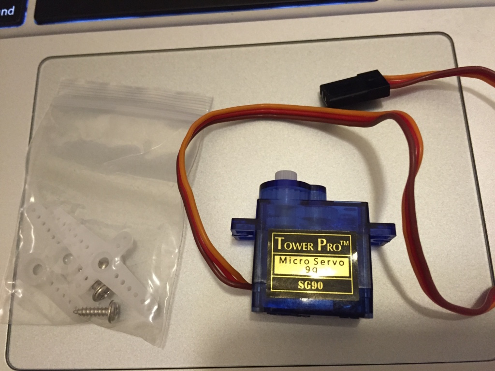
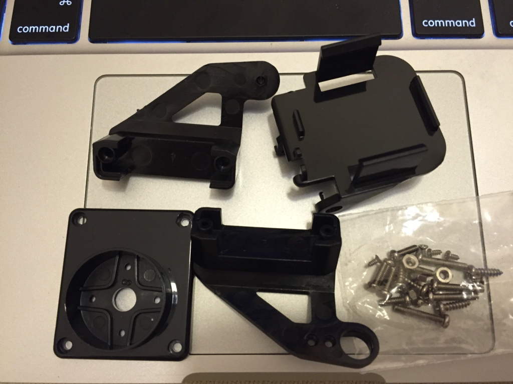
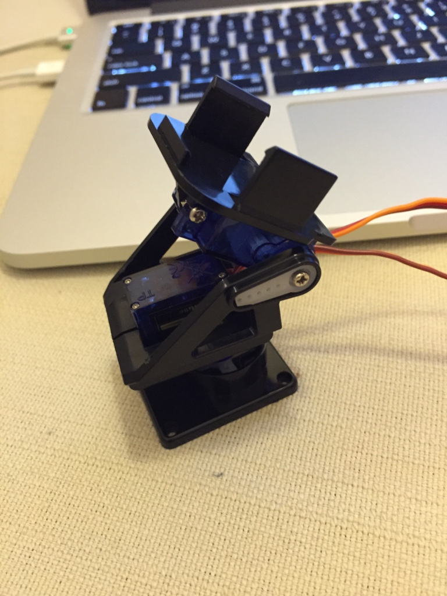
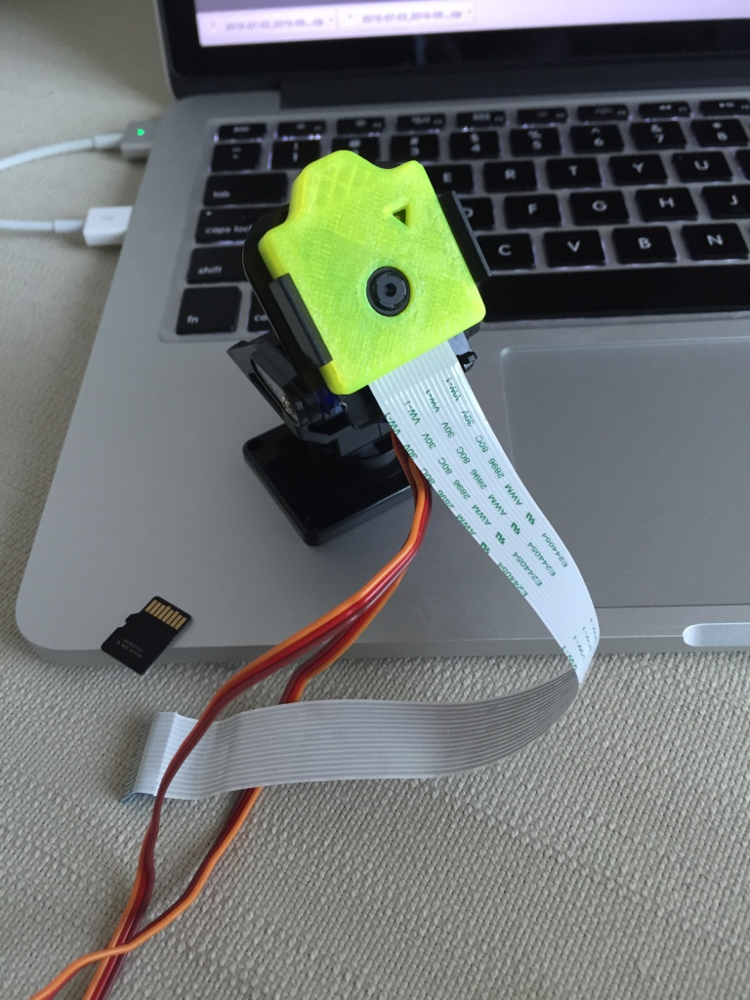
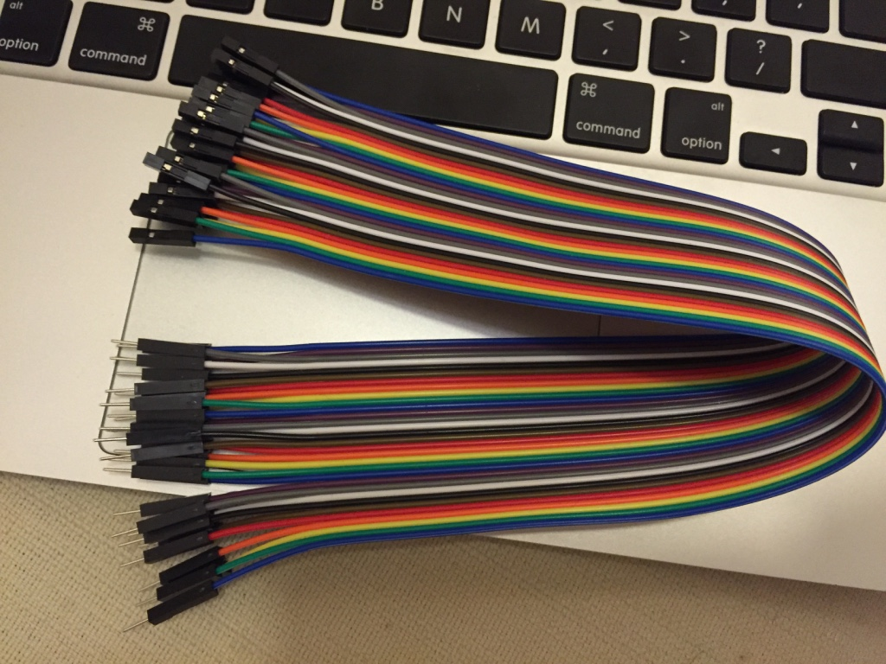
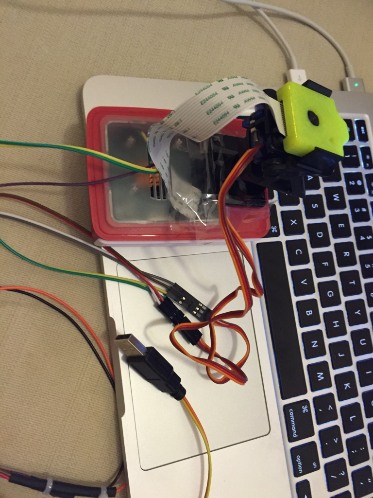

#Hardware
1. Standard connection of Pi Camera module
2. Servos
  1. Signal of Servo 0 connect to GPIO 4
  2. Signal of Servo 1 connect to GPIO 17
  3. Vin and ground of Servo 0, and 1 connect to external power (e.g. using usb to dupont cable)
  4. Ground of external power connect to GND pin on Pi
    1. [USB to dupont cable](assets/usb2dupont.jpg)
    2. [Pi GPIO pin assignment](assets/piGpioPin.png)
  5. Try it, based on Try it of Install and Setup ServoBlaster below

#Parts
1. [Micro Servos](assets/microServo.jpg)
2. [Bracket Parts](assets/bracketParts.jpg)
3. [Bracket with Servos](assets/bracket.jpg)
4. [Micro Servos](assets/bracketWithPiCam.jpg)
5. [Dupont cables](assets/dupontCable.jpg)
6. [Assembled](assets/assembled.jpg)
