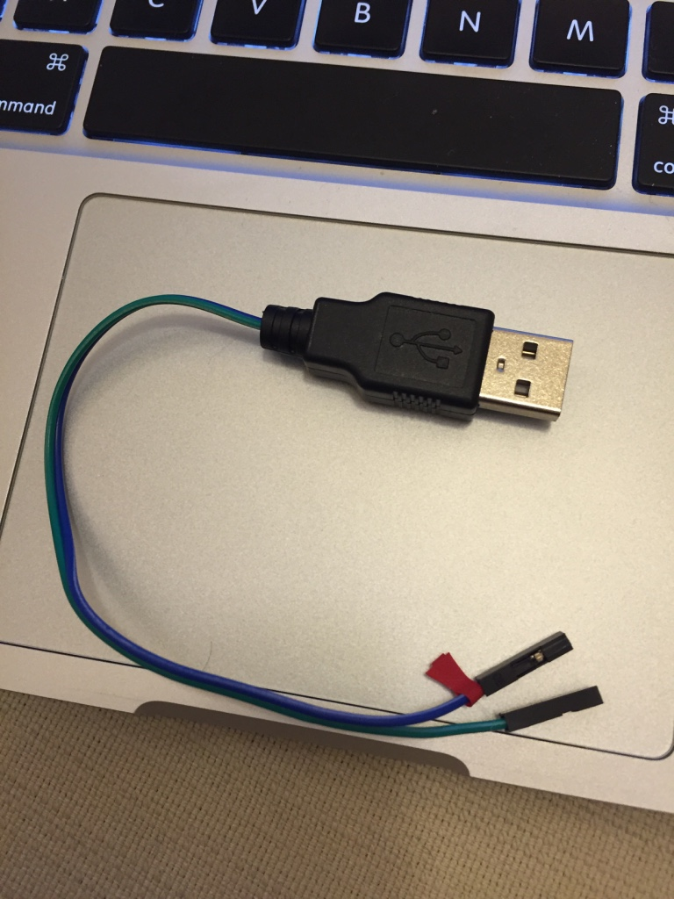

#Installation steps
##Site A
###Hardware
1. Standard connection of Pi Camera module
2. Servos
  1. Signal of Servo 0 connect to GPIO 4
  2. Signal of Servo 1 connect to GPIO 17
  3. Vin and ground of Servo 0, and 1 connect to external power (e.g. using usb to dupont cable)
  4. Ground of external power connect to GND pin on Pi
    1. [USB to dupont cable](assets/usb2dupont.jpg)
    2. [Pi GPIO pin assignment](assets/piGpioPin.png)
  5. Try it, based on Try it of Install and Setup ServoBlaster below

###Install and Setup Raspbian
Headless installation (i.e. no keyboard, mouse, and monitor attached to the pi)

1. Download raspbian image (e.g. 2016-03-18-raspbian-jessie.zip) from (https://www.raspberrypi.org/downloads/), and unzip it
2. Format the SD card (MS-DOS FAT)
3. Write the raspbian image to the sd card (assumed on Linux/Mac and sd card on /dev/disk2)
  1. `diskutil diskunmountDisk /dev/disk2`
  2. `sudo dd bs=1m if=2016-03-18-raspbian-jessie.img of=/dev/rdisk2`
  3. `diskutil eject /dev/disk2`
4. Plug the sd into the pi and also plug in the LAN cable, then power on the pi
5. Check the IP address of the Pi, by using tools like nmap
  * E.g. `nmap -sP 192.168.1.0/24`
6. SSH to the pi (default: user name is pi, password is raspberry), assumed the ip address is 192.168.1.10
  * `shh pi@192.168.1.10`
7. Modify the `~/.profile` file, append the 2 lines below
  * `export LC_ALL=C`
  * `export LC_CTYPE=UTF-8`
8. Source the updated .profile
  * `source ~/.profile`
9. Update the config file (`/etc/wpa_supplicant/wpa_supplicant.conf`) for wifi access
  * Append the block like below
  ```
network={
ssid="Your Wireless Network Name"
psk="Your Wireless Password"
# Protocol type can be: RSN (for WPA2) and WPA (for WPA1)
proto=RSN

# Key management type can be: WPA-PSK or WPA-EAP (Pre-Shared or Enterprise)
key_mgmt=WPA-PSK

# Pairwise can be CCMP or TKIP (for WPA2 or WPA1)
pairwise=CCMP

#Authorization option should be OPEN for both WPA1/WPA2 (in less commonly used are SHARED and LEAP)
auth_alg=OPEN
}
  ```
10. Run raspi-config to change configuration
  1. sudo raspi-config
  2. 1. Expand Filesystem
  3. 5. Internationalisation Options -> I1 Change Timezone
  4. 6. Enable Camera
  5. 9. Advanced Options -> A2 Hostname
  6. 9. Advanced Options -> A0 Update
  7. Finish and reboot, if there is no prompt for reboot, then can run
    * `sudo reboot`
11. Update the system package
  * `sudo apt-get update`
12. Upgrade the installed package
  * `sudo apt-get dist-upgrade`

###Install and Setup Mjpg-Streamer
1. Install dependencies
  1. `sudo apt-get install libjpeg8-dev imagemagick libv4l-dev cmake`
  2. Create a symoblic link
    * `sudo ln -s /usr/include/linux/videodev2.h /usr/include/linux/videodev.h`
2. Download and unzip mjpg-streamer
  1. `wget https://github.com/jacksonliam/mjpg-streamer/archive/master.zip`
  2. `unzip master.zip`
3. Make it
  1. `cd mjpg-streamer-master/mjpg-streamer-experimental`
  2. `make clean all`
4. Copy the build files
  1. `sudo cp mjpg_streamer /usr/local/bin`
  2. `sudo cp *.so /usr/local/lib/`
  3. `sudo cp -R www /usr/local/www`
5. Modify `~/.profile`, append the following line, and source it
  1. `export LD_LIBRARY_PATH=/usr/local/lib/`
  2. `source ~/.profile`
6. Try it
  1. If try Pi camera module, then runs
    * `mjpg_streamer -b -o "output_http.so -w /usr/local/www" -i "input_raspicam.so -x 640 -y 480 -fps 60"`
  2. If try usb camera module, then runs
    * `mjpg_streamer -b -o "output_http.so -w /usr/local/www" -i "input_uvc.so"`
  3. Note `-b` means background execution
  4. Start a browser and visit the url below (change the ip if necessary)
    * `http://192.168.1.7:8080/`
7. Start it after boot, and capture 640x480 resolution at 60fps
  1. Create a script file `~/start_mjpg_streamer.sh` with the following content
```
#!/bin/sh
mjpg_streamer -b -o "output_http.so -w /usr/local/www" -i "input_raspicam.so -x $1 -y $2 -fps $3"
```
  2. Change the mode of the file to 755
    * `chmod 755 ~/start_mjpg_streamer.sh`
  3. Append the following line to the `~/.profile`
    * `~/start_mjpg_streamer.sh 640 480 60`


