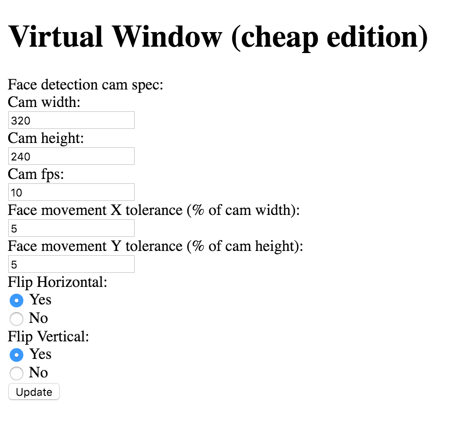

#Install and Setup VMC Server and Client
1. Download or clone this repo (cheap-virtual-window)
2. Start a command prompt and change to server directory
  * `cd server`
3. Install the package by npm
  * `npm install`
4. Configuration on `server/lib/config/server.js`
  1. Change the `httpPort` if necessary
  2. Change the `dataServerUrl` if necessary
5. Configuration on `client/index.html`
  1. Change the `src` of the `iframe` if necessary.  It is a url to the Mjpg-Streamer of the Pi
6. Client configuration can change on UI
  1. (default value stored in `server/lib/routes/socket.js`)[UI Parameters](assets/parameters.png)
    1. Face tracking camera
      * camWidth: 320
      * camHeigh: 240
      * cam fps: 10
    2. Face tracking tolerance (face tracking data will not send to dataServer on Pi if movement within these tolerance setting
      * X: 5% of the camWidth
      * Y: 5% of the camHeight
    3. Flipping
      * flipHorizontal: true
      * flipVertical: false
7. Start the server by node
  * `node server.js`
8. Start the client by browser like Chrome, and go to the below url (change the url port number if the it is changed on step 4b)
  * http://localhost:18080
